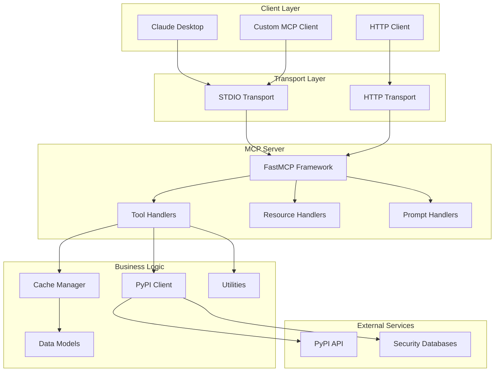
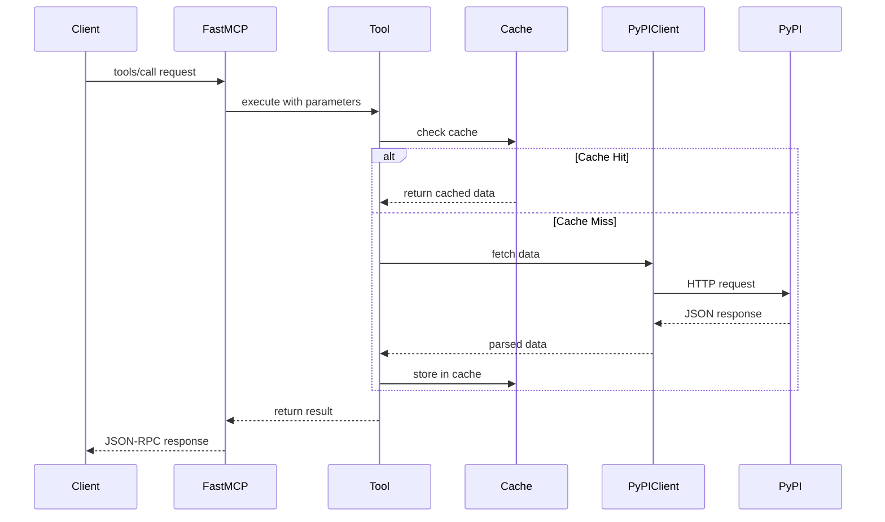
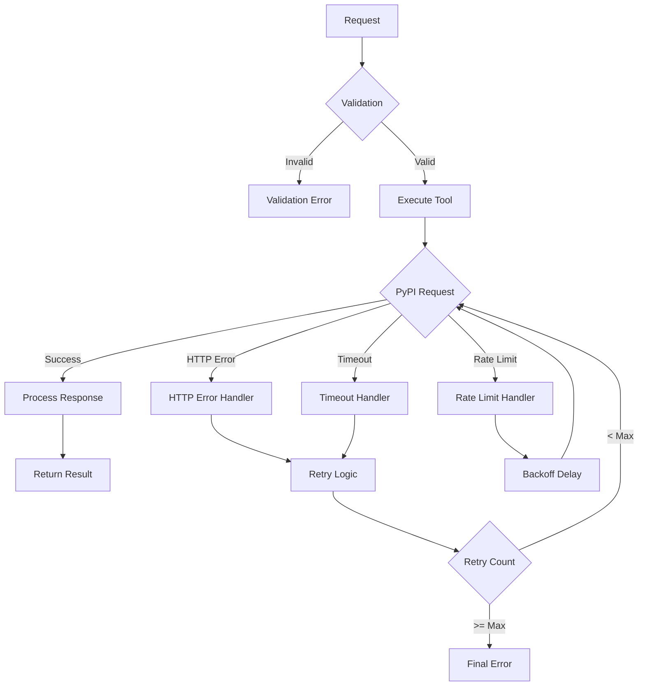

# Architecture Guide

Comprehensive overview of the PyPI MCP Server architecture, design patterns, and implementation details.

## System Overview

The PyPI MCP Server is built as a modern, async-first application that bridges AI models with the Python Package Index through the Model Context Protocol.



## Core Components

### 1. FastMCP Framework

The foundation of the server, providing:

- **Protocol Implementation**: JSON-RPC 2.0 and MCP protocol handling
- **Transport Abstraction**: Support for STDIO and HTTP transports
- **Tool Registration**: Decorator-based tool definition
- **Resource Management**: URI-based resource access
- **Prompt Templates**: Structured AI prompt generation

```python
# Example tool registration
@mcp.tool
async def get_package_info(package_name: str, version: Optional[str] = None) -> Dict:
    """Get detailed package information."""
    # Implementation
```

### 2. PyPI Client (`client.py`)

Handles all interactions with PyPI APIs:

```python
class PyPIClient:
    """Async client for PyPI API interactions."""

    async def get_package_info(self, package_name: str, version: Optional[str] = None) -> PackageInfo:
        """Get package information from PyPI."""

    async def get_package_versions(self, package_name: str) -> List[str]:
        """Get all versions of a package."""

    async def get_pypi_stats(self) -> PyPIStats:
        """Get PyPI-wide statistics."""
```

#### Key Features:

- **Async/Await**: Non-blocking HTTP requests using httpx
- **Rate Limiting**: Built-in rate limiting to respect PyPI limits
- **Error Handling**: Comprehensive error handling and retries
- **Data Transformation**: Converts PyPI responses to internal models

### 3. Data Models (`models.py`)

Pydantic models for type safety and validation:

```python
class PackageInfo(BaseModel):
    """Represents package metadata from PyPI."""
    name: str
    version: str
    summary: str
    # ... other fields

    @field_validator("name")
    @classmethod
    def validate_name(cls, v):
        """Validate package name format."""
        return normalize_package_name(v)
```

#### Model Categories:

- **Core Models**: PackageInfo, PackageFile, Vulnerability
- **Response Models**: SearchResult, ComparisonResult, HealthAssessment
- **Utility Models**: DependencyInfo, CacheStats

### 4. Cache Manager (`cache.py`)

Intelligent caching system for performance optimization:

```python
class CacheManager:
    """TTL-based cache with LRU eviction."""

    def __init__(self, ttl: int, max_size: int):
        self.cache = TTLCache(maxsize=max_size, ttl=ttl)

    async def get_or_fetch(self, key: str, fetch_func: Callable) -> Any:
        """Get from cache or fetch and cache."""
```

#### Cache Features:

- **TTL Expiration**: Automatic expiration based on time
- **LRU Eviction**: Removes least recently used items when full
- **Statistics**: Hit rate, miss rate, and size tracking
- **Configurable**: TTL and size limits via environment variables

### 5. Configuration (`config.py`)

Centralized configuration management:

```python
class Settings(BaseSettings):
    """Configuration settings using Pydantic Settings."""

    # PyPI API settings
    pypi_base_url: str = "https://pypi.org"
    timeout: float = 30.0

    # Cache settings
    cache_ttl: int = 300
    cache_max_size: int = 1000

    class Config:
        env_prefix = "PYPI_MCP_"
        env_file = ".env"
```

## Design Patterns

### 1. Async/Await Pattern

All I/O operations use async/await for non-blocking execution:

```python
async def get_package_info(package_name: str) -> PackageInfo:
    """Async function for package info retrieval."""
    async with httpx.AsyncClient() as client:
        response = await client.get(f"/pypi/{package_name}/json")
        return PackageInfo.parse_obj(response.json())
```

### 2. Dependency Injection

Configuration and clients are injected rather than imported:

```python
# Global client instance
client = PyPIClient(settings=settings)

# Tools use the injected client
async def tool_function():
    async with client:
        return await client.get_package_info("requests")
```

### 3. Factory Pattern

Server creation uses factory pattern for flexibility:

```python
def create_server() -> FastMCP:
    """Factory function to create configured server."""
    mcp = FastMCP(name=settings.server_name)

    # Register tools
    register_package_tools(mcp)
    register_security_tools(mcp)

    return mcp
```

### 4. Decorator Pattern

Tools, resources, and prompts use decorators:

```python
@mcp.tool
async def get_package_info(package_name: str) -> Dict:
    """Tool decorator automatically registers the function."""

@mcp.resource("pypi://package/{package_name}")
async def package_resource(package_name: str) -> str:
    """Resource decorator with URI pattern."""

@mcp.prompt
async def analyze_package(package_name: str) -> str:
    """Prompt decorator for AI templates."""
```

## Data Flow

### 1. Tool Execution Flow



### 2. Error Handling Flow



## Performance Considerations

### 1. Async Architecture

- **Non-blocking I/O**: All network operations are async
- **Concurrent Requests**: Multiple requests can be processed simultaneously
- **Resource Efficiency**: Lower memory and CPU usage compared to threading

### 2. Caching Strategy

- **Multi-level Caching**: In-memory cache with configurable TTL
- **Cache Warming**: Pre-populate cache with popular packages
- **Cache Statistics**: Monitor hit rates for optimization

### 3. Rate Limiting

- **Client-side Rate Limiting**: Respect PyPI's rate limits
- **Exponential Backoff**: Automatic retry with increasing delays
- **Circuit Breaker**: Fail fast when PyPI is unavailable

### 4. Memory Management

- **Bounded Cache**: LRU eviction prevents memory leaks
- **Streaming Responses**: Large responses are streamed when possible
- **Garbage Collection**: Proper cleanup of async resources

## Security Architecture

### 1. Input Validation

All inputs are validated using Pydantic models:

```python
def validate_package_name(name: str) -> bool:
    """Validate package name according to PyPI rules."""
    pattern = r"^[a-zA-Z0-9]([a-zA-Z0-9._-]*[a-zA-Z0-9])?$"
    return bool(re.match(pattern, name))
```

### 2. Error Information Disclosure

Errors are sanitized to prevent information disclosure:

```python
try:
    result = await dangerous_operation()
except InternalError as e:
    # Don't expose internal details
    raise PyPIMCPError("Operation failed") from None
```

### 3. Rate Limiting Protection

Built-in protection against abuse:

```python
class RateLimiter:
    """Token bucket rate limiter."""

    async def acquire(self) -> bool:
        """Acquire a token, returns False if rate limited."""
```

## Extensibility

### 1. Plugin Architecture

The server can be extended with new tools:

```python
def register_custom_tools(mcp: FastMCP):
    """Register custom tools."""

    @mcp.tool
    async def custom_analysis(package_name: str) -> Dict:
        """Custom package analysis tool."""
        # Implementation
```

### 2. Custom Data Sources

New data sources can be integrated:

```python
class CustomDataClient:
    """Client for custom data source."""

    async def get_custom_data(self, package_name: str) -> Dict:
        """Fetch data from custom source."""
```

### 3. Transport Extensions

New transport protocols can be added:

```python
class WebSocketTransport:
    """WebSocket transport implementation."""

    async def handle_connection(self, websocket):
        """Handle WebSocket connections."""
```

## Testing Architecture

### 1. Test Structure

```
tests/
├── unit/                  # Unit tests (fast, isolated)
├── integration/           # Integration tests (real APIs)
├── performance/           # Performance and load tests
├── fixtures/             # Test data and fixtures
└── conftest.py           # Pytest configuration
```

### 2. Mocking Strategy

- **HTTP Mocking**: Use respx for HTTP request mocking
- **Async Mocking**: AsyncMock for async function mocking
- **Fixture Data**: Realistic test data from PyPI

### 3. Test Categories

- **Unit Tests**: Fast, isolated, no external dependencies
- **Integration Tests**: Test with real PyPI API
- **Performance Tests**: Load testing and benchmarking
- **End-to-End Tests**: Full workflow testing

## Deployment Architecture

### 1. Container Deployment

```dockerfile
FROM python:3.11-slim
WORKDIR /app
COPY . .
RUN pip install -e .
CMD ["pypi-mcp", "--transport", "http", "--host", "0.0.0.0"]
```

### 2. Kubernetes Deployment

```yaml
apiVersion: apps/v1
kind: Deployment
metadata:
  name: pypi-mcp
spec:
  replicas: 3
  selector:
    matchLabels:
      app: pypi-mcp
  template:
    spec:
      containers:
        - name: pypi-mcp
          image: pypi-mcp:latest
          ports:
            - containerPort: 8000
          env:
            - name: PYPI_MCP_CACHE_TTL
              value: "600"
```

### 3. Load Balancing

- **Horizontal Scaling**: Multiple server instances
- **Session Affinity**: Not required (stateless design)
- **Health Checks**: Built-in health check endpoints

## Monitoring and Observability

### 1. Logging

Structured logging with configurable levels:

```python
logger = logging.getLogger(__name__)
logger.info("Package info retrieved", extra={
    "package_name": package_name,
    "cache_hit": cache_hit,
    "response_time": response_time
})
```

### 2. Metrics

Key metrics to monitor:

- **Request Rate**: Requests per second
- **Response Time**: Average and percentile response times
- **Cache Hit Rate**: Cache effectiveness
- **Error Rate**: Error percentage by type

### 3. Health Checks

Built-in health check endpoints:

```python
@mcp.tool
async def health_check() -> Dict:
    """Health check endpoint."""
    return {
        "status": "healthy",
        "timestamp": datetime.utcnow().isoformat(),
        "cache_status": await get_cache_stats()
    }
```

## Future Architecture Considerations

### 1. Microservices

Potential split into microservices:

- **Package Service**: Package information and metadata
- **Security Service**: Vulnerability scanning and analysis
- **Analytics Service**: Statistics and analytics
- **Cache Service**: Distributed caching layer

### 2. Event-Driven Architecture

Potential event-driven enhancements:

- **Package Updates**: React to package update events
- **Cache Invalidation**: Event-driven cache invalidation
- **Analytics**: Real-time analytics processing

### 3. GraphQL API

Potential GraphQL interface:

- **Flexible Queries**: Client-specified data requirements
- **Type Safety**: Strong typing for API contracts
- **Real-time Subscriptions**: Live data updates

## Next Steps

- [Contributing Guidelines](contributing.md) - Learn how to contribute
- [Testing Guide](testing.md) - Comprehensive testing information
- [Development Setup](development-setup.md) - Set up development environment
- [Release Process](release-process.md) - How releases are made
