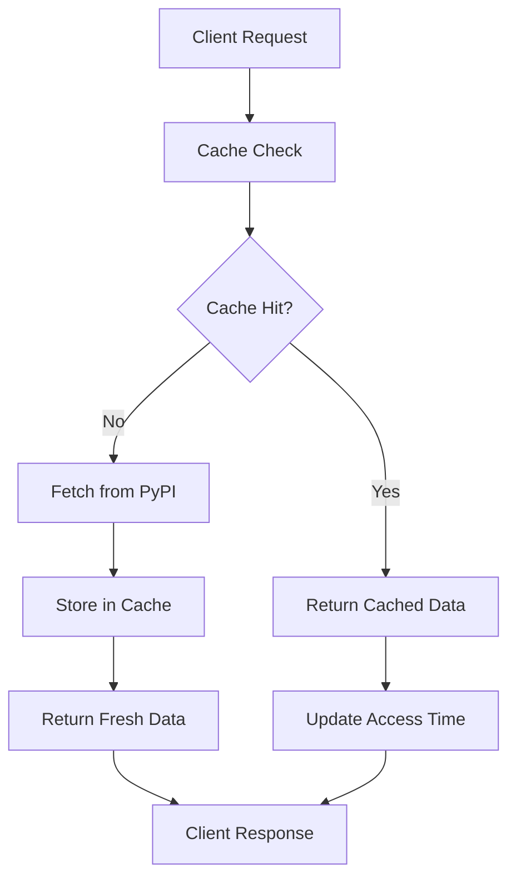

# Caching Guide

Understand and optimize the PyPI MCP Server's intelligent caching system for better performance.

## Overview

The PyPI MCP Server includes a sophisticated caching system that reduces API calls to PyPI, improves response times, and provides better reliability. The cache uses TTL (Time To Live) expiration and LRU (Least Recently Used) eviction policies.

## How Caching Works

### Cache Architecture



### Cache Layers

1. **Memory Cache**: In-memory storage using `cachetools.TTLCache`
2. **TTL Expiration**: Automatic expiration based on time
3. **LRU Eviction**: Removes least recently used items when cache is full
4. **Size Limits**: Configurable maximum number of cached items

## Configuration

### Environment Variables

Configure caching behavior with these environment variables:

```bash
# Cache TTL in seconds (default: 300 = 5 minutes)
export PYPI_MCP_CACHE_TTL=300

# Maximum number of cached items (default: 1000)
export PYPI_MCP_CACHE_MAX_SIZE=1000
```

### Configuration Examples

#### Development Configuration

```bash
# Short TTL for development (1 minute)
export PYPI_MCP_CACHE_TTL=60
export PYPI_MCP_CACHE_MAX_SIZE=100
```

#### Production Configuration

```bash
# Longer TTL for production (15 minutes)
export PYPI_MCP_CACHE_TTL=900
export PYPI_MCP_CACHE_MAX_SIZE=5000
```

#### High-Performance Configuration

```bash
# Very long TTL for high performance (30 minutes)
export PYPI_MCP_CACHE_TTL=1800
export PYPI_MCP_CACHE_MAX_SIZE=10000
```

#### Memory-Constrained Configuration

```bash
# Smaller cache for limited memory
export PYPI_MCP_CACHE_TTL=300
export PYPI_MCP_CACHE_MAX_SIZE=200
```

## What Gets Cached

### Cached Operations

The following operations are cached:

| Operation            | Cache Key                  | TTL      |
| -------------------- | -------------------------- | -------- |
| **Package Info**     | `package:{name}:{version}` | Full TTL |
| **Package Versions** | `versions:{name}`          | Full TTL |
| **Package Search**   | `search:{query}:{limit}`   | Full TTL |
| **Dependencies**     | `deps:{name}:{version}`    | Full TTL |
| **Vulnerabilities**  | `vulns:{name}:{version}`   | Full TTL |
| **PyPI Stats**       | `stats:overview`           | Full TTL |
| **Package Health**   | `health:{name}:{version}`  | Full TTL |

### Cache Keys

Cache keys are automatically generated based on:

- **Operation type**: The specific tool being called
- **Parameters**: All input parameters that affect the result
- **Normalization**: Package names are normalized for consistency

Example cache keys:

```
package:requests:2.31.0
package:requests:latest
versions:django
search:web framework:10
deps:fastapi:0.104.1
vulns:django:3.2.0
```

## Cache Performance

### Monitoring Cache Performance

Use the `get_cache_info` tool to monitor cache performance:

=== "MCP Tool Call"
`json
    {
      "tool": "get_cache_info"
    }
    `

=== "Python Client"
```python
from pypi_mcp.cache import get_cache_stats

    # Get cache statistics
    stats = await get_cache_stats()
    print(f"Hit rate: {stats['hit_rate']:.2%}")
    print(f"Cache size: {stats['current_size']}/{stats['max_size']}")
    print(f"Hits: {stats['hits']}, Misses: {stats['misses']}")
    ```

### Cache Metrics

The cache provides these metrics:

- **Hit Rate**: Percentage of requests served from cache
- **Hits**: Number of cache hits
- **Misses**: Number of cache misses
- **Current Size**: Number of items currently in cache
- **Max Size**: Maximum cache capacity

### Interpreting Metrics

#### Good Cache Performance

```json
{
  "hit_rate": 0.85,
  "hits": 850,
  "misses": 150,
  "current_size": 450,
  "max_size": 1000
}
```

#### Poor Cache Performance

```json
{
  "hit_rate": 0.25,
  "hits": 250,
  "misses": 750,
  "current_size": 1000,
  "max_size": 1000
}
```

## Cache Optimization

### Optimizing Hit Rate

#### 1. Increase Cache Size

If you have available memory and low hit rate:

```bash
# Increase cache size
export PYPI_MCP_CACHE_MAX_SIZE=5000
```

#### 2. Increase TTL

For relatively stable package data:

```bash
# Increase TTL to 30 minutes
export PYPI_MCP_CACHE_TTL=1800
```

#### 3. Warm Up Cache

Pre-populate cache with frequently accessed packages:

```python
async def warm_up_cache():
    """Pre-populate cache with popular packages."""
    popular_packages = [
        'requests', 'numpy', 'pandas', 'django', 'flask',
        'fastapi', 'pytest', 'setuptools', 'wheel', 'pip'
    ]

    async with client:
        for package in popular_packages:
            try:
                await client.get_package_info(package)
                await client.get_dependencies(package)
                await client.check_vulnerabilities(package)
            except Exception as e:
                print(f"Failed to cache {package}: {e}")

# Run during application startup
await warm_up_cache()
```

### Memory Optimization

#### Calculate Memory Usage

Estimate cache memory usage:

```python
def estimate_cache_memory(max_size, avg_item_size_kb=10):
    """Estimate cache memory usage."""
    total_mb = (max_size * avg_item_size_kb) / 1024
    return f"{total_mb:.1f} MB"

# Examples
print(f"1000 items: {estimate_cache_memory(1000)}")    # ~10 MB
print(f"5000 items: {estimate_cache_memory(5000)}")    # ~50 MB
print(f"10000 items: {estimate_cache_memory(10000)}")  # ~100 MB
```

#### Memory-Efficient Settings

For memory-constrained environments:

```bash
# Conservative memory usage
export PYPI_MCP_CACHE_MAX_SIZE=500
export PYPI_MCP_CACHE_TTL=300
```

## Cache Strategies

### Strategy 1: High Performance

Maximize cache hit rate for performance:

```bash
export PYPI_MCP_CACHE_TTL=3600      # 1 hour
export PYPI_MCP_CACHE_MAX_SIZE=10000
```

**Use when:**

- Performance is critical
- Memory is abundant
- Package data doesn't change frequently

### Strategy 2: Balanced

Balance between performance and freshness:

```bash
export PYPI_MCP_CACHE_TTL=900       # 15 minutes
export PYPI_MCP_CACHE_MAX_SIZE=2000
```

**Use when:**

- Moderate performance requirements
- Limited memory
- Need reasonably fresh data

### Strategy 3: Fresh Data

Prioritize data freshness over performance:

```bash
export PYPI_MCP_CACHE_TTL=300       # 5 minutes
export PYPI_MCP_CACHE_MAX_SIZE=500
```

**Use when:**

- Data freshness is critical
- Memory is limited
- Can tolerate slower responses

### Strategy 4: Development

Optimize for development workflow:

```bash
export PYPI_MCP_CACHE_TTL=60        # 1 minute
export PYPI_MCP_CACHE_MAX_SIZE=100
```

**Use when:**

- Developing and testing
- Need fresh data for testing
- Limited resources

## Cache Invalidation

### Automatic Invalidation

Cache entries are automatically invalidated when:

1. **TTL Expires**: Items expire after the configured TTL
2. **Cache Full**: LRU eviction removes oldest items
3. **Server Restart**: Cache is cleared on restart

### Manual Cache Management

Currently, there's no manual cache invalidation API, but you can:

1. **Restart the server** to clear all cache
2. **Wait for TTL expiration** for specific items
3. **Reduce TTL temporarily** for faster refresh

### Future Enhancements

Planned cache management features:

- Manual cache invalidation API
- Selective cache clearing
- Cache warming endpoints
- Cache statistics export

## Troubleshooting Cache Issues

### Low Hit Rate

**Symptoms:**

- Hit rate below 50%
- Slow response times
- High PyPI API usage

**Solutions:**

1. **Check cache size**:

   ```python
   stats = await get_cache_stats()
   if stats['current_size'] >= stats['max_size']:
       # Cache is full, increase size
       pass
   ```

2. **Increase cache size**:

   ```bash
   export PYPI_MCP_CACHE_MAX_SIZE=5000
   ```

3. **Increase TTL**:
   ```bash
   export PYPI_MCP_CACHE_TTL=1800
   ```

### High Memory Usage

**Symptoms:**

- High memory consumption
- Out of memory errors
- System slowdown

**Solutions:**

1. **Reduce cache size**:

   ```bash
   export PYPI_MCP_CACHE_MAX_SIZE=500
   ```

2. **Reduce TTL**:

   ```bash
   export PYPI_MCP_CACHE_TTL=300
   ```

3. **Monitor memory usage**:

   ```python
   import psutil
   import os

   process = psutil.Process(os.getpid())
   memory_mb = process.memory_info().rss / 1024 / 1024
   print(f"Memory usage: {memory_mb:.1f} MB")
   ```

### Cache Inconsistency

**Symptoms:**

- Stale data returned
- Inconsistent responses
- Missing recent package updates

**Solutions:**

1. **Reduce TTL**:

   ```bash
   export PYPI_MCP_CACHE_TTL=300
   ```

2. **Restart server** to clear cache

3. **Check PyPI API status** for upstream issues

## Best Practices

### 1. Monitor Cache Performance

Regularly check cache statistics:

```python
async def monitor_cache():
    """Monitor cache performance."""
    stats = await get_cache_stats()

    hit_rate = stats['hit_rate']
    if hit_rate < 0.7:
        print(f"Warning: Low hit rate {hit_rate:.2%}")

    utilization = stats['current_size'] / stats['max_size']
    if utilization > 0.9:
        print(f"Warning: High cache utilization {utilization:.2%}")
```

### 2. Configure for Your Use Case

Choose appropriate settings based on your needs:

- **Interactive applications**: Shorter TTL (5-15 minutes)
- **Batch processing**: Longer TTL (30-60 minutes)
- **Development**: Very short TTL (1-5 minutes)
- **Production**: Balanced TTL (15-30 minutes)

### 3. Consider Data Freshness Requirements

Balance performance vs. freshness:

- **Security data**: Shorter TTL for vulnerability information
- **Package metadata**: Longer TTL for stable information
- **Statistics**: Medium TTL for aggregate data

### 4. Plan for Memory Usage

Estimate and plan memory requirements:

```python
def plan_cache_memory(packages_per_hour, avg_session_minutes=30):
    """Plan cache memory requirements."""
    items_in_cache = (packages_per_hour * avg_session_minutes) / 60
    memory_mb = (items_in_cache * 10) / 1024  # 10KB per item estimate
    return {
        'estimated_items': int(items_in_cache),
        'estimated_memory_mb': f"{memory_mb:.1f} MB",
        'recommended_max_size': int(items_in_cache * 1.5)
    }

# Example planning
plan = plan_cache_memory(packages_per_hour=100)
print(f"Recommended cache size: {plan['recommended_max_size']}")
print(f"Estimated memory: {plan['estimated_memory_mb']}")
```

## Next Steps

- [Performance Guide](../troubleshooting/performance.md) - Optimize overall performance
- [Configuration Guide](configuration.md) - Advanced configuration options
- [Monitoring Guide](../troubleshooting/debugging.md) - Monitor server performance
